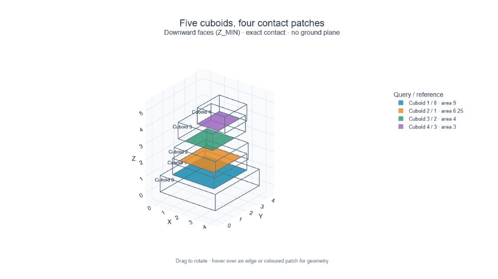

# aabb-primitives

**Pairwise box geometry, with Torch tensors.**

Calculate distances, intersections, overlap, containment, and contact patches
between collections of axis-aligned boxes. Use the same functions for a single
scene or tensors with arbitrary broadcastable batch dimensions.



*Five boxes, four contacts. Each colored rectangle is the intersection of an
upper box's downward face with the box below it.*

## Start with a geometric question

Which reference boxes touch the bottom of this query box?

```python
import torch
import aabb_primitives as aabb

queries = torch.tensor([[0., 0., 1., 2., 2., 2.]], dtype=torch.float64)
references = torch.tensor([
    [0., 0., 0., 1., 2., 1.],  # Touches the bottom; patch area = 2.
    [3., 0., 0., 4., 2., 1.],  # Same height, but no XY overlap.
], dtype=torch.float64)

# Optional numerical checks at the input boundary.
aabb.validate_aabbs(queries)
aabb.validate_aabbs(references)
aabb.validate_thresholds(distance_tolerance=0.0)

contacts = aabb.contact_mask(
    queries, references,
    face=aabb.AABBFace.Z_MIN,
    distance_tolerance=0.0,
)
areas = aabb.projected_overlap_areas(queries, references, aabb.AABBFace.Z_MIN)

assert contacts.tolist() == [[True, False]]
assert areas[contacts].tolist() == [2.0]
```

The library calculates geometric contact. It does not determine stability,
forces, packing feasibility, or ground contact.

## Representation and direction

An AABB is a row of six coordinates:

```text
[xmin, ymin, zmin, xmax, ymax, zmax]
```

Use dense Torch tensors with `float32` or `float64` coordinates. Query and
reference tensors must share dtype and device. CPU behavior is the supported,
tested contract for this release; CUDA and autograd are not yet supported
guarantees. Operations perform no automatic dtype conversion or device transfer.

Queries and references are roles, not necessarily different collections:

```text
queries     (Q, 6)
references  (R, 6)
result      (Q, R, ...)
```

`result[q, r]` describes query `q` relative to reference `r`. Passing the same
tensor twice compares every ordered pair in that scene. Self-pairs are not
automatically removed. With zero tolerance and positive box extents, a box's
opposing faces do not contact each other; degenerate boxes or larger tolerances
can produce self-contact results.

Faces are ordered `X_MIN, X_MAX, Y_MIN, Y_MAX, Z_MIN, Z_MAX`. Each query face is
compared with the opposite reference face. Signed distance is positive for a
gap, zero for alignment, and negative after the selected faces cross. A negative
signed distance is not necessarily the actual overlap depth.

## Batching without special dimensions

Only the final two input dimensions have fixed meanings: boxes and coordinates.
Leading dimensions follow Torch broadcasting. Pairwise outputs preserve the
resolved batch dimensions, followed by query and reference rows.

| Query shape | Reference shape | Pairwise mask shape | Meaning |
|---|---|---|---|
| `(Q, 6)` | `(R, 6)` | `(Q, R)` | One comparison |
| `(S, Q, 6)` | `(S, R, 6)` | `(S, Q, R)` | Aligned independent scenes |
| `(S, Q, 6)` | `(R, 6)` | `(S, Q, R)` | One shared reference collection |
| `(B, K, Q, 6)` | `(B, 1, R, 6)` | `(B, K, Q, R)` | Shared references within each environment |
| `(B, 1, Q, 6)` | `(1, K, R, 6)` | `(B, K, Q, R)` | Every combination of the two batch axes |

The caller assigns meanings such as scenes, environments, or alternative
placements. Matching batch axes give aligned comparisons; singleton axes can
intentionally create combinations. Incompatible dimensions raise an error.

For example, compare three alternatives with the same packed scene in each of
two environments:

```python
candidate_boxes = queries.expand(2, 3, 1, 6)   # B=2, K=3, Q=1
packed_boxes = references.expand(2, 2, 6)      # B=2, R=2

shared_contacts = aabb.contact_mask(
    candidate_boxes, packed_boxes[:, None, :, :],
    face=aabb.AABBFace.Z_MIN,
    distance_tolerance=0.0,
)
assert shared_contacts.shape == (2, 3, 1, 2)
```

## Choose the quantity you need

All functions are available directly from `aabb_primitives`. Pairwise functions
take `query_aabbs, reference_aabbs` first, followed by an axis or face where
applicable. Detailed argument and shape documentation is available through
Python's `help()`.

| Question | Functions | Output after the batch dimensions |
|---|---|---|
| How far apart are opposing faces? | `signed_distances`, `signed_distances_all_faces` | `(Q, R)` or `(Q, R, 6)` |
| Where do intervals intersect? | `intersection_bounds`, `intersection_bounds_all_axes` | `(Q, R, 2)` or `(Q, R, 3, 2)` |
| How much overlap is there? | `overlap_lengths`, `overlap_lengths_all_axes` | `(Q, R)` or `(Q, R, 3)` |
| What is the projected intersection? | `projected_intersection_bounds`, `tangential_overlap_lengths`, `projected_overlap_areas` | `(Q, R, 4)`, `(Q, R, 2)`, or `(Q, R)` |
| How large is the query face? | `query_face_areas` (query input only) | `(Q,)` |
| Do boxes overlap or contain one another? | `axis_overlap`, `axis_overlap_all_axes`, `projected_overlap_mask`, `contained_by_mask` | Boolean pairwise results; all-axis overlap adds a final `3` |
| Do references cross inward query bounds? | `inward_projected_overlap_mask`, `inward_axis_overlap_all_axes` | `(Q, R)` or `(Q, R, 3)` |
| Are opposing faces within a distance interval? | `within_distance` | `(Q, R)` |
| Which faces contact, and where? | `contact_mask`, `query_face_contact_patches` | One-face mask, or all-face patches and mask |

### Bounds, overlap, and contact are different

- Raw intersection bounds retain inverted intervals for disjoint boxes. They
  are not automatically valid rectangles or patches.
- Overlap lengths clip negative lengths to zero. Strict overlap requires
  positive length; touching at an edge or point does not create positive area.
- Projection onto a face uses its two tangential axes: Y/Z for X faces, X/Z for
  Y faces, X/Y for Z faces. Projected bounds are `[min1, min2, max1, max2]`.
- `contact_mask` requires positive tangential overlap and absolute signed face
  distance within `distance_tolerance`. It can also require minimum patch lengths.
- Containment includes equality. Inward-overlap predicates use strict crossings
  of inset query bounds; they are not equivalent to a minimum overlap length.

### Contact patches for all six faces

```python
patches, face_mask = aabb.query_face_contact_patches(
    queries, references, distance_tolerance=0.0,
)
assert patches.shape == (1, 2, 6, 6)
assert face_mask.shape == (1, 2, 6)
assert face_mask[0, 0, 4].item()  # Z_MIN
assert patches[0, 0, 4].tolist() == [0., 0., 1., 1., 2., 1.]
```

The last two patch axes are **query face, AABB coordinates**. Each accepted
patch lies on the selected query face, including when a tolerance accepts a
small gap or penetration. Invalid entries contain six zeros; the boolean mask
is authoritative. This method supports `distance_tolerance` and
`minimum_face_crossing`; use `contact_mask` for additional per-axis patch-length
requirements. Keep the individual-face operations when only one face is needed.

## Validation and tolerances

Operations check shape, dtype, device, enum arguments, and broadcasting using
metadata. They assume finite coordinates with non-negative extents and valid
numerical thresholds. Empty collections and zero-extent boxes are supported.

Use `validate_aabbs(tensor)` and `validate_thresholds(...)` once when accepting
new inputs. They raise descriptive errors without repairing or converting data.
Numerical checks scan values and may synchronize an accelerator. Revalidate
after changes to externally supplied data.

`validate_thresholds` accepts optional keyword arguments `distance_tolerance`,
`minimum_face_crossing`, `inset`, `minimum_patch_lengths`, `minimum_distance`, and
`maximum_distance`. Omitted arguments are ignored. All supplied values must be
finite; only the signed distance limits may be negative. When both limits are
provided, they must broadcast together and satisfy `minimum_distance <= maximum_distance`.

Tolerances and distance limits accept a Python float, a scalar float tensor, or
a tensor shaped `(*threshold_batch, Q)`. Patch-length limits accept a pair of
Python floats or a tensor shaped `(*threshold_batch, Q, 2)`. Tensor thresholds
must be dense float32/float64 tensors on the same device as the boxes; they may
use a different supported floating dtype to retain threshold precision. Query
row counts must match exactly. Threshold batches may broadcast **into** the
resolved box batch shape, but cannot add output batches. Operations enforce this
alignment even when numerical validation has been omitted.

`minimum_face_crossing` denotes the minimum actual overlap length for ordinary
overlap and contact predicates. Equality is accepted, but zero-length overlap
is still rejected when the threshold is zero. `within_distance` includes both
distance endpoints; contact accepts both positive gaps and negative crossings
within the absolute tolerance. Coordinates retain the units supplied by the caller.

## Visual demos

Run these scripts from the repository root. Each opens an interactive local
Plotly figure with labeled boxes and hoverable geometric results.

```shell
uv run --extra examples python examples/01_stacked_contact_patches.py
uv run --extra examples python examples/02_three_scene_contact_patches.py
uv run --extra examples python examples/03_projected_intersection_bounds.py
```

| Demo | What it shows | Expected result |
|---|---|---|
| One stack | Exact downward contacts in one self-comparison | Pairs `(1,0), (2,1), (3,2), (4,3)`; areas `9, 6.25, 4, 3` |
| Three scenes | One calculation on `(3, 5, 6)` boxes | Stack: 4 patches; bridge: 4; separate towers: 3 |
| Projection versus contact | Overlapping XY footprints with a two-unit Z gap | Areas `2.25, 3`; no 3D contacts |

The bridge pairs are `(2,0), (2,1), (3,2), (4,2)`, with areas
`4.5, 4.5, 2.5, 2.5`. The towers have pairs `(1,0), (2,1), (4,3)`, all with area `3`.

Geometry and filtering stay in Torch. NumPy is used only at the plotting
boundary. Examples require a desktop browser, generate no saved output files,
and use no Plotly account or hosted service. If you close or reload the single-use
viewer, rerun the script. Download and cloud-sharing toolbar buttons are disabled.

## Cost and scope

Each pairwise operation performs work proportional to `Q × R` per resolved
batch entry. Outputs can be large: all-face patches store 36 coordinates per
pair, in addition to their mask. Broadcasting avoids copying shared inputs,
but does not make pairwise outputs free.

Functions keep no state or cache. Retain returned tensors in your application
when you reuse them; calling a function again recalculates its result. There
is no spatial index, sparse candidate search, implicit rounding, snapping, or
automatic self-exclusion. No performance advantage over another library is claimed.

## Install and develop

Python 3.10 or newer is required; `.python-version` selects Python 3.12 for local
development. From a checkout, install with `python -m pip install .`, or use
[uv](https://docs.astral.sh/uv/getting-started/installation/):

```shell
uv sync --group dev --extra examples
uv run pytest
uv run ruff check src tests examples
uv run ruff format --check src tests examples
uv build
```

Core dependencies are Torch, Jaxtyping, and Beartype. The `examples` extra adds
NumPy and Plotly. Example tests are skipped when those optional dependencies
are absent. Ruff uses a 120-character line-width target.

## Migrating from 0.1

Version 0.2 is experimental and intentionally breaks the old NumPy API.

```python
# Before (0.1; NumPy arrays):
# relations = PairwiseAABBRelations.from_aabbs(
#     query_aabbs=queries, reference_aabbs=references,
# )
# contacts = relations.contact_mask(AABBFace.Z_MIN, distance_tolerance=0.0)

# Now (0.2; Torch tensors):
contacts = aabb.contact_mask(
    queries, references, aabb.AABBFace.Z_MIN, distance_tolerance=0.0,
)
```

Convert arrays explicitly with `torch.from_numpy()` if needed; it shares storage
with the NumPy array. Callers own input lifetimes and mutations. Replace
constructor validation with explicit validators, and remove singleton dimensions
previously added solely to satisfy the `(B, K, Q, 6)` interface.

There is no compatibility class, NumPy backend, or implicit input snapshot.

MIT licensed. See [LICENSE](LICENSE).
